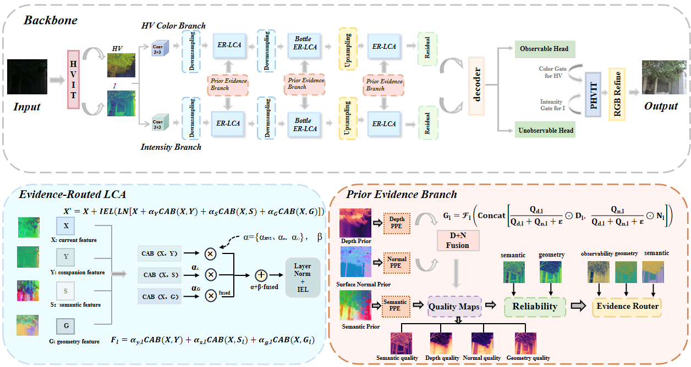
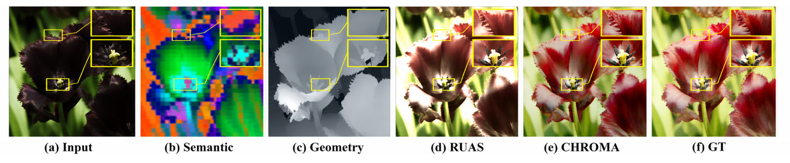

<p align="center">
  <a href="README.md"><b>English</b></a> &nbsp;|&nbsp; <a href="README_zh.md">中文</a>
</p>

<p align="center">
  <h1 align="center">DAMG</h1>
  <p align="center">
    <b>Degradation-Aware Multi-Prior Guidance</b> for<br>
    <em>Extreme Low-Light Image Enhancement</em>
  </p>
  <p align="center">
    Jiayuan Chen &nbsp;·&nbsp; Yi Chen &nbsp;·&nbsp; Yuxiang Lin &nbsp;·&nbsp; Bingbing Zhong &nbsp;·&nbsp; Xinjie Shi &nbsp;·&nbsp; Xingxing Yang
  </p>
  <p align="center">
    <a href="https://github.com/AlexYangxx/DAMG"></a>
    
    
  </p>
</p>

<p align="center">
  
</p>

---
## Highlights

- **Degradation-aware multi-prior fusion.** DAMG performs spatially adaptive fusion between HVI photometric features and heterogeneous vision-foundation priors, so severely under-constrained regions can receive stronger semantic/geometric conditioning while recoverable regions remain anchored to observation-supported cues.
- **Local guidance map (two-path restoration).** A learned local-guidance map mixes an input-consistent restoration pathway and a prior-guided enhancement pathway.
- **Source-level adaptive fusion.** Learned fusion weights allocate contributions among photometric / semantic / geometric streams using prior gating signals.
- **Prior gating regularization.** Prior gating maps keep fusion weights consistent with gating signals without requiring external reliability annotations.
- **Region-aware objectives.** Dual-branch decoding and region-aware losses reduce interference from a shared decoding backbone across different degradation regimes.

---
## Architecture

<p align="center">
  
</p>

The network is implemented as a dual-branch encoder–decoder with heterogeneous priors. At inference time, the model consumes the low-light RGB observation and (optionally) precomputed semantic / depth / normal prior maps. Internally, it uses:

- HVI photometric representation: `RGB_HVI`
- prior pyramid encoders: `PriorPyramidEncoder`
- confidence / quality estimators: `ConfidenceEstimator`
- source fusion / routing: `EvidenceRouter` + fusion blocks
- restoration heads and refiner blocks: `ReconstructionHead`, `RefinementHead`

```text
Low-light input x
  ├─ HVI photometric stream  ───────────────► decoder/refiner ──► restored output
  ├─ semantic prior (optional) ─────────────► prior encoders + routing
  └─ geometric prior (optional) ────────────► prior encoders + routing
```

| Module | Role | Class / config in this repo |
| --- | --- | --- |
| Photometric representation | HVI feature extraction / handling | `RGB_HVI` |
| Semantic / geometric priors | Prior feature encoding | `PriorPyramidEncoder` |
| Confidence & quality | Validity / gating maps | `ConfidenceEstimator` |
| Adaptive source fusion | Evidence routing between streams | `EvidenceRouter` |
| Restoration heads | Branch-specific reconstruction + refinement | `ReconstructionHead`, `RefinementHead` |
| Main model wrapper | End-to-end inference | `DAMG` |

---
## News

- Code and evaluation utilities are available in this repository.

---
## Repository layout

This project contains a lightweight LLIE implementation (not a BasicSR overlay):

```text
DAMG/
├── damg_network/
│   ├── damg.py                      # DAMG main model (forward/inference)
│   ├── hvi_photometric.py          # RGB_HVI
│   ├── semantic_geometric_priors.py
│   ├── adaptive_fusion.py
│   └── feature_transformer.py
├── damg_data/
│   ├── data.py                     # dataset + prior loading helpers
│   ├── prior_utils.py             # prior indexing + loading
│   ├── eval_sets.py              # eval dataset definitions
│   └── (dataset-specific folders)
├── restoration_objectives/
│   └── losses.py                  # restoration losses
├── eval.py                         # inference / evaluation entry
├── measure.py                      # PSNR/SSIM/LPIPS evaluation
├── experiments/
│   ├── reproduce_all.py            # run default eval sweep
│   └── train_damg_*.ps1           # training scripts (require train.py)
└── LICENSE
```

---
## Installation

```bash
pip install torch torchvision opencv-python lpips numpy pillow tqdm
```

> Tip: use a CUDA-enabled PyTorch build for faster inference.

---
## Data preparation

### Dataset layout

`eval.py` writes results under `./output/` and reads inputs from dataset-specific roots. For example:

- LOLv1: `./datasets/LOLdataset/eval15/low`
- LOLv2-real: `./datasets/LOLv2/Real_captured/Test/Low`
- LOLv2-syn: `./datasets/LOLv2/Synthetic/Test/Low`
- SICE_grad: `./datasets/SICE/SICE_Grad`
- SICE_mix: `./datasets/SICE/SICE_Mix`
- FiveK: `./datasets/FiveK/test/input`

For measurement (`measure.py`), ground-truth locations are hard-coded inside `measure.py`. See its `--lol`, `--lol_v2_real`, etc. flags for the expected GT folders.

### Prior maps (semantic / depth / normal)

DAMG can optionally load semantic / depth / normal priors from directory roots:

- `--semantic_prior_dir`
- `--depth_prior_dir`
- `--normal_prior_dir`

Optional quality priors:

- `--semantic_quality_dir`
- `--depth_quality_dir`
- `--normal_quality_dir`

Supported prior file extensions:

`png`, `jpg`, `jpeg`, `bmp`, `npy`, `npz`, `pt`, `pth`.

**Prior matching rule (important):** prior indexing searches the directory tree and tries to resolve each prior by either

1. relative path key under the prior root, or
2. filename stem key.

If a semantic/depth/normal prior is missing, DAMG falls back to defaults internally (semantic defaults to a clone of the input tensor; depth defaults to a channel mean; normal is derived from depth gradients).

---
## Training

This repository intentionally omits the training entry file (`train.py`) from uploads. The scripts under `experiments/` still show the intended usage:

```powershell
./experiments/train_damg_lolv1.ps1
./experiments/train_damg_lolv2_real.ps1
./experiments/train_damg_lolv2_synthetic.ps1
```

These scripts call `python train.py ...`, so training requires having `train.py` available in the repo root.

---
## Testing

### Run evaluation

`eval.py` supports dataset switches and prior directories. Examples:

```bash
python eval.py --lol_v2_real \
  --weights_path ./weights/LOLv2_real/wo_perc.pth \
  --lite_mode safe \
  --semantic_in_channels 384 \
  --semantic_prior_dir ./priors/lolv2_real_eval/semantic \
  --depth_prior_dir ./priors/lolv2_real_eval/depth \
  --normal_prior_dir ./priors/lolv2_real_eval/normal \
  --strict_prior_loading
```

Useful flags:

- `--tta_mode none|hflip|flip4`
- `--amp` (mixed precision on CUDA)
- `--tile_size` / `--tile_overlap` (sliding-window inference)
- `--dump_aux_maps` (save auxiliary routing/quality maps)

### Default evaluation sweep

```bash
python experiments/reproduce_all.py
```

### Measure metrics

```bash
python measure.py --lol
python measure.py --lol_v2_real
python measure.py --lol_v2_syn
```

---
## Visual comparisons

Qualitative outputs can be generated by running `eval.py` (or `experiments/reproduce_all.py`). Restored images are saved under:

- `./output/LOLv1/`
- `./output/LOLv2_real/`
- `./output/LOLv2_syn/`
- `./output/SICE_grad/`, `./output/SICE_mix/`, `./output/fivek/` (and others)

You can also directly view the provided “SOTA qualitative visualization” PDFs:

- Paired benchmarks (LOLv1 / LOLv2): [`sota_lol_visual.pdf`](assets/sota_lol_visual.pdf)
- Unpaired benchmarks: [`sota_unpaired_visual.pdf`](assets/sota_unpaired_visual.pdf)

---
## Results

Quantitative numbers are produced by running `measure.py` on outputs created by `eval.py`.

---
## Reproducing ablations

Ablation / switchable components are implemented inside the model code (`damg_network/`). For changes to inference behavior, prefer editing `eval.py` flags (e.g. priors and `lite_mode`) and the model instantiation in `eval.py`.

---
## Method in one page

Given a low-light observation, DAMG combines three streams:

1. **Photometric HVI features** derived from the RGB input
2. **Semantic priors** (optional): encoded by `PriorPyramidEncoder`
3. **Geometric priors** (optional): depth + normal encoded by `PriorPyramidEncoder`

At each location, adaptive routing (`EvidenceRouter`) produces source weights for photometric / semantic / geometric contributions. A local guidance map then mixes two restoration pathways to reduce interference between recoverable and severely degraded regions.

---
## Acknowledgements

- HVI / low-light priors and routing inspiration in this codebase
- Depth priors (when used): [Depth Anything 3](https://github.com/ByteDance-Seed/Depth-Anything-3)
- Semantic priors (when used): common self-supervised vision transformer backbones
- Code base (added as requested): [CIDNet](https://github.com/fediory/hvi-cidnet)

---
## License

This project is released under the [MIT License](LICENSE).

---
## Contact

Please open a [GitHub issue](https://github.com/AlexYangxx/DAMG/issues) for questions about the code.

